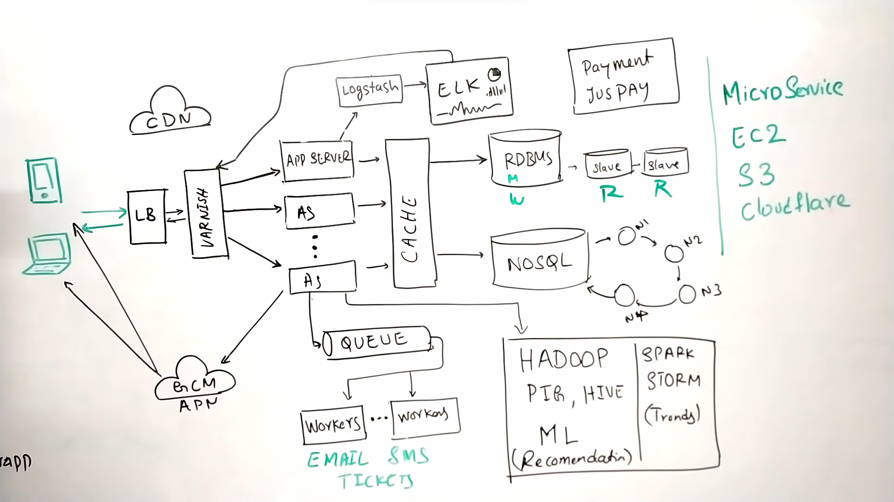

## PROJECT DESCRIPTION:=>
- WHAT IS AN ONLINE MOVIE TICKET BOOKING SYSTEM ?
	A movie ticket booking system provides its customers the ability to purchase theatre seats online.
	E-ticketing systems allow the customers to browse through movies currently being played and to book seats, anywhere and 		anytime.
### Requirements and Goals of the System

> **Functional Requirements**
1. Our ticket booking service should be able to list down different cities where its affiliate cinemas are located.
2. Once the user selects the city, the service should display the movies released in that particular city.
3. Once the user selects the movie, the service should display the cinemas running that movie and its available shows.
4. The user should be able to select the show at a particular cinema and book their tickets.
5. The service should be able to show the user the seating arrangement of the cinema hall and the user should be able to select multiple seats according to their preference.
6. The user should be able to distinguish available seats from the booked ones.
7. Users should be able to put a hold on the seats for five minutes before they make a payment to finalize the booking.
8. The user should be able to wait if there is a chance that seats might become available – e.g. when holds by other users expire.
9. Waiting customers should be serviced fairly in a first come first serve manner.

> **Non-Functional Requirements:**
1. The system would need to be highly concurrent. There will be multiple booking requests for the same seat at any particular point in time. The service should handle this gracefully and fairly.
2. The core thing of the service is ticket booking which means financial transactions. This means that the system should be secure and the database ACID compliant.

------------

### TECH-STACK:=>

	1. Python
	2. Django and Django-rest-framework    
	3. Unit testing using **Pytest and django.test**
	4. Logging
	5. API monitoring using Sentry.io
	6. Message Queue with Rabbitmq
	7. Task scheduling using Celery
	8. Caching using **Redis**/Memcached
	9. Docker and Docker-compose
	10. SQL Database-POSTGRES
	11. Nosql Database=Mongodb
	12. For deployment=>AWS ec2,s3,etc...
	13. Payment Gateway Integration using Razorpay or Payu or stripe(Undecided)
	14. Github actions for just get to know with CI/CD pipeline

------------

### SYSTEM DESIGN:=>
                        

------------

### APIS :=>
	1. getCities/
	2. getTheatreByCity/
	3. getMovieByTheatre/
	4. getAuditoriumByMovie/
	5. getShowByAuditorium/
	6. bookseat/
	7. sendticketbyemial/
	8. postcommentsandreview/
	9. getAvailableSeatByShows/

------------

### DB DESIGN:=>
> Relationship Between RDBMS Tables:

1. One to many: Place and theatre.
2. One to many: Theatre and screen
3. One to many: Screen and Tier
4. One to many: Tier and seats
5. One to one: Screen and Movie
6. One to many: User and Tickets
7. One to many: Tickets and Seats

> NoSQL TablesNoSQL Tables

THERE WILL BE NO RELATIONSHIP BETWEEN THESE TABLES. 

1. Comments
2. Ratings
3. Movie Information
4. Trailers or Gallery
5. Artists
6. Cast and Crew
7. Reviews
8. Analytics Data 

------------
### Commands And Extra Info on what is used and what will be:=>

####press alt+m shortcut

------------

